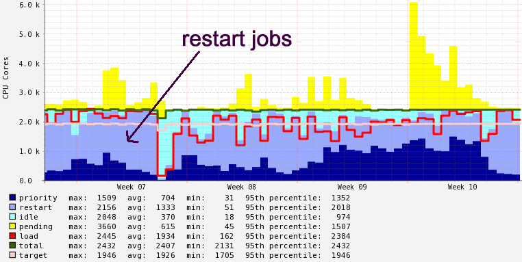
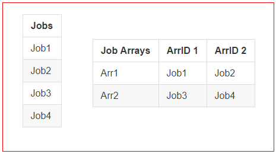

# Running an Analysis using 40,000 cluster jobs 

- A Scientist asked how he can accelerate his R script
- The script had a loop with 40k iterations, each running ~ 10m
- would run ~270 days using a single CPU
- a good case for our restart queue if we can make it run parallel
- This readme is also a [presentation](http://fredhutch.github.io/slurm-examples/centipede.html)

---

# The restart queue 

- quick batch access to > 1000 cores  
- very few users, almost always capacity !!!!

---

# Best practices for 'restart' jobs 

- jobs get killed quickly if not enough resources in priority 
  queue (campus) 
- average run job run time is more than 1.5h . 

Recommendations:

- Write intermediate **results to disk** at regualr intervals
  (check pointing not in scope for this tutorial)
- make sure jobs run short so they are **not often interrupted**
- jobs should be short but **not too short**, 15-30  min ideal

---

# Definitions

- **Job** :	one script submitted to an HPC cluster 

- **Analysis** : an experiment has one or more Jobs 

- **Loop** : set of instructions that need to be repeated X times 
  (X must be a known number)

- **Iteration** : running through a loop a single time

- **Stepsize** : number of consecutive iterations through a loop

---

# The problem 

	!R
	# In the loop below, 'i' indexes genes.
	# To parallelize, we'd break up range of 'i' into 1:10, 11:20, etc.
	for (i in 1:dim(LGG.GBM.mut)[1]) {
		print(paste(i, Sys.time(), sep="   "))		
		tmpMutTbl <- LGG.GBM.mut[-i , ]
		.
		.
		D.after <- as.matrix(as.dist(max(SNV.CNV) - SNV.CNV))
		D <- sum(abs(D.before - D.after))		
		effectLOO <- c(effectLOO, D)		
	}

- loops over many genes sequentially on a single compute core 
- collects results in vector **effectLOO**, but does not save it
- running for 270 days before saving your data? 

--- 

# how long should a loop take ?

STEPSIZE = number of iterations per loop or job

with a STEPSIZE of 1 
	
	!R
	for (i in 1:1) {   ~ 10 min
	for (i in 2:2) {   ~ 10 min
	for (i in 3:3) {   ~ 10 min
	for (i in 4:4) {   ~ 10 min
	for (i in 5:5) {   ~ 10 min
	for (i in 6:6) {   ~ 10 min
	
.. or with a STEPSIZE of 2
	
	!R
	for (i in 1:2) {   ~ 20 min
	for (i in 3:4) {   ~ 20 min
	for (i in 5:6) {   ~ 20 min
	
- a STEPSIZE of 2 : 10 min * 2 iterations = 20 min compute time
- not efficient if a job waited 5 min but then ran only 2 min
	
---

# saving the state of each loop

    !R
    # begin loop
    {	
		D <- sum(abs(D.before - D.after))		
		effectLOO <- c(effectLOO, D)		
	}

	# save each variable to disk instead of adding to vector
	
	# begin loop
	{
	    save(D.after, file=paste0(scratch,'/',i,"-D.after.RData.tmp"))
        file.rename(paste0(scratch,'/',i,"-D.after.RData.tmp"),
		            paste0(scratch,'/',i,"-D.after.RData"))
	}
	
- save into a tmp file first and then rename it. Why? 
- What else is needed ? Zoom out!

---

# What is slowing us down in HPC?

- jobs require input files that **need to be prepared** (wait for prep, then 
  start the real job)
- not worth running the prep work on the cluster, don't know **how to "connect" **
  the 2 work steps on the cluster
- I need to **manually re-run failed jobs** before I can merge the outputs 
  of all jobs into a single result file  
- I **cannot use the restart** queue because each of my jobs runs too long
  and is often killed by a higher priority job 

---

# Centipede Slurm example

- Centipede is a simple **shell script** that can make using a Slurm cluster 
  **much easier**.
- Using the centipede command one can submit **many thousand** short running 
  **jobs** to a Slurm HPC cluster. 
- The script goes through all **4 phases** of a typical HPC pipeline which 
  needs to split up the computational work across many nodes. 
- **standardized** approach for calling Python and R scripts

---

# The 4 phases are:

1. **Data preparation:**
   Input files are not available in an expected format and need to be
   prepared. 
2. **Parallel execution:**
   The computational problem needs to be split up into many smaller 
   problems that can be distributed to many compute nodes. 
3. **error correction:**
   A small percentage of jobs often fails. The script should detect this
   failure and rerun only the failed jobs 
4. **merge of data:**
   collect data files generated by each job from disk and merge the data 
   into a single vector, sequence, list, dictionary, data frame or table 
   
---

# Command arguments for SCRIPT

- Centipede assumes that you want to launch another script (e.g. using R
  or Python) which is set in the SCRIPT variable. 

- It assumes that SCRIPT takes at least 1 or 2 command line args each of which 
  tell SCRIPT to execute one of the 4 different phases. 

---

# Arguments for example.R:

-  Phase 0: ./example.R listsize  (get array size - not run via slurm)
-  Phase 1: ./example.R prepare   (initial data preparation)
-  Phase 2: ./example.R run xx    (run $listsize # of jobs)
-  Phase 3: ./example.R run xx    (run only the failed jobs with no outfile) 
-  Phase 4: ./example.R merge     (merge the output files) 

---

# example.R running each phase:

    !R
	# get the list size #########
	if (args[1] == 'listsize') {
		cat(mylistsize)
	}	
	# prepare  phase #########
	if (args[1] == 'prepare') {
	   #...prepare something
	}	
	# execute parallel job ###########
	if (args[1] == 'run') {
		# run something
	}	
	# merge job ############
	if (args[1] == 'merge') {
		# merge something
	}

---

# centipede (sce) setup 

sce itself can take at least 2 arguments, SCRIPT and ANALYSIS. 
You can change these constants:

    !bash
    ANALYSIS='myProbe1'  # change for every analysis you run (2nd arg)
    MAILDOM='@fhcrc.org' # your email domain (for error messages)
    MAXARRAYSIZE=1000    # set to 0 if you are not using slurm job arrays
    MYSCRATCH="./scratch/${ANALYSIS}"  # location of your scratch dir
    PARTITION='restart'  # a queue on your cluster for very short jobs
    RESULTDIR="./result/${ANALYSIS}"  # A permanent storage location
    SCRIPT='./example.R' # your code as (R or Python) script (1st arg)
    STEPSIZE=2           # number of consecutive loops in SCRIPT to run in
                         # the same job / node (increase for short jobs)
                         
to start the python example without editing the script, run it like this:

    ./sce ./example.py myFirstPyJob  OR
    ./sce ./example.py myFirstPyJob some other example.py arguments

---

# Job Arrays 

- do not submit more than 5000 jobs to gizmo, squeue gets sluggish
- to run 40000 jobs submit 40 job arrays with 1000 elements each
- Job Arrays = # of Loops / MAXARRAYSIZE

---

# Setup your storage folders 

    !bash
    ANALYSIS='myProbe1'  # change for every analysis you run (2nd arg)
    MYSCRATCH="/fh/scratch/delete30/pilastname_f/${ANALYSIS}" 
    RESULTDIR="/fh/fast/pilastname_f/projectx/${ANALYSIS}"

- edit script sce directly 	
- files in scratch/delete30 get **removed 30 days** after they have been 
  touched last 
- **fast file** is best suited for **result files** (backed up to tape, etc)
- constants (UPPERCASE) are passed on as **environment variables** to SCRIPTS
  called by sce

---

# Environment variables inherited 

in your R code  

    !R
    #! /usr/bin/env Rscript

    # get environment variables
    MYSCRATCH <- Sys.getenv('MYSCRATCH')
    RESULTDIR <- Sys.getenv('RESULTDIR')
    STEPSIZE <- as.numeric(Sys.getenv('STEPSIZE'))
    TASKID <- as.numeric(Sys.getenv('SLURM_ARRAY_TASK_ID'))

    # set defaults if nothing comes from environment variables
    MYSCRATCH[is.na(MYSCRATCH)] <- '.'
    RESULTDIR[is.na(RESULTDIR)] <- '.'
    STEPSIZE[is.na(STEPSIZE)] <- 1
    TASKID[is.na(TASKID)] <- 0

---

# and in python ...

    !python
	# get environment variables
	MYSCRATCH = os.getenv('MYSCRATCH', '.')
	RESULTDIR = os.getenv('RESULTDIR', '.')
	STEPSIZE = int(os.getenv('STEPSIZE', 1))
	TASKID = int(os.getenv('SLURM_ARRAY_TASK_ID', 0))

- getting defaults is slightly simpler here 
- TASKID AND STEPSIZE required for job arrays 
  and we'll get to that in a minute
	
---

# Environment vs command line 

- environment variables are **inherited by all** processes (scripts) launched
  by the current script, MYSCRATCH is valid for centipede and example.R
  
- command line arguments need to be **explicitly passed** they are not implicitly 
  inherited from a parent process 
  
- Rule of thumb: Use environment variables for variables that **do not change**
  such as the scratch folder and command line arguments for things that 
  change such as a loop iterator, etc
  
---

# sce example 

## lets dive into the code ......

- you can look at the full code: 
  https://raw.githubusercontent.com/FredHutch/slurm-examples/master/centipede/sce

- or browse to it:
  https://github.com/FredHutch/slurm-examples/tree/master/centipede
  
---

# The 'prepare' phase

    !bash
    echo "submitting ${SCRIPT} prepare in ${MYSCRATCH}..." 
    sbatch --dependency=singleton --job-name=${ANALYSIS} \
           --mail-type=FAIL --mail-user="${username}{MAILDOM}" \
           --output="${MYSCRATCH}/output/${ANALYSIS}.prepare.%J" \
		   --partition=${PARTITION} --time=0-3 --requeue \
           --wrap="${SCRIPT} prepare dummy $3 $4 $5 $6 $7 $8 $9"

    # get a colon separated list of job ids (normally a single id)
	wj=$(squeue -O "%A" -h -u ${username} -n ${ANALYSIS} -S i | tr "\n" ":")
    waitforjobs=${wj%?} #remove the last character (:) from string

- set --job-name=${ANALYSIS} for all jobs 
- adjust wall clock --time if required 
  (the maximum time this job may use)
- --requeue is not for failed jobs (just preempted ones)

---	

# The 'run' phase 

	!bash
	# dividing job list into multiple job arrays
	numjobs=$((${listsize}/${MAXARRAYSIZE}+1))
	arrupper=$MAXARRAYSIZE
	for i in $(seq 1 $numjobs); do
	  if [[ $i -eq $numjobs ]]; then
	    # set last arraysize to remainder 
		arrupper=$((${listsize}-${arrid}))
	  fi
	  echo "submitting ${SCRIPT} run in ${MYSCRATCH}"
	  echo "with ${STEPSIZE} ${arrid} dependent on ${waitforjobs}..."
	  sbatch --dependency=afterok:${waitforjobs} --job-name=${ANALYSIS} \
		   --partition=${PARTITION} --array=1-${arrupper}:${STEPSIZE} \
		   --mail-type=FAIL --mail-user="${username}${MAILDOM}" --time=0-1 \
		   --output="${MYSCRATCH}/out/${ANALYSIS}.run.${arrid}_%a_%A.%J" \
		   --wrap="${SCRIPT} run ${arrid} $3 $4 $5 $6 $7 $8 $9" --requeue
	  arrid=$((${arrid}+${MAXARRAYSIZE}))
	done
	
- called SCRIPT to get listsize aka number of iterations:  
  listsize=$(${SCRIPT} listsize) 

---

# Save to tmp file and rename !

    !R
    for (..............) {
        myrnd <- sample(i:10000,1,replace=T)        
        # save to a temp file and then rename it as last action !
        save(myrnd, file=paste0(MYSCRATCH,'/run/',i,"-run.dat.tmp"))
        file.rename(paste0(MYSCRATCH,'/run/',i,"-run.dat.tmp"),
                    paste0(MYSCRATCH,'/run/',i,"-run.dat"))
    }

- renaming is very fast, interruption unlikely
 
--- 

# a job submitting more jobs
    
	!bash
    echo "submitting control job with args '$@' "
	echo "that waits and resubmits failed jobs..."
    sbatch --dependency=singleton --job-name=${ANALYSIS} \
	       --partition=${PARTITION} --requeue --time=0-4 \
           --mail-type=FAIL --mail-user="${username}${MAILDOM}" \
           --output="${MYSCRATCH}/out/${ANALYSIS}.correct.%J" \
           --wrap="RETRYFAILED=$numjobs ${thisscript} $1 $2 $3 ...
 

---
 
# rerun failed jobs 

	!bash
    # re-run all failed jobs where the appropriate output file is missing
    # --requeue works only for preempted jobs 
    for i in $(seq 1 $RETRYFAILED); do
        id=$((${i}*${STEPSIZE}-${STEPSIZE}+1))
        if ! [[ -f "${MYSCRATCH}/run/${i}-run.dat" ]]; then
            echo "re-submitting ${SCRIPT} run ${id}"
            sbatch --dependency=singleton --job-name=${ANALYSIS} \
			       --partition=${PARTITION} --requeue --time=0-2 \
                   --mail-type=FAIL --mail-user="${username}${MAILDOM}" \
                   --output="${MYSCRATCH}/out/${ANALYSIS}.run2.${i}.%J" \
                   --wrap="${SCRIPT} run ${id} $3 $4 $5 $6 $7 $8 $9"
        fi
    done

--- 

# the 'merge' phase

	!bash
    echo "submitting ${SCRIPT} merge ${listsize}..."
    sbatch --dependency=singleton --job-name=${ANALYSIS} \
	       --partition=${PARTITION} --requeue --time=0-5 \
           --mail-type=END,FAIL --mail-user="${username}${MAILDOM}" \
           --output="${MYSCRATCH}/out/${ANALYSIS}.merge.%J" \
           --wrap="${SCRIPT} merge ${listsize} $3 $4 $5 $6 $7 $8 $9"

---

# Troubleshooting I

**Error: DependencyNeverSatisfied**

submit a job: ./sce ./example.py X2 one two three

    petersen@rhino2:/home…$ squeue -u petersen
    JOBID    PARTITION  USER   ST  TIME  NODES NODELIST(REASON)
    32249193  restar  petersen PD  0:00      1 (DependencyNeverSatisfied)
    32249194  restar  petersen PD  0:00      1 (Dependency)

mistake: added args that example.py does not support:
	
    petersen@rhino2:/home…$ cat scratch/X2/out/X2.prepare.32249433 
    usage: example.py [-h] phase [id]
    example.py: error: unrecognized arguments: one two three

cancel jobs where dependencies will never be satisfied:

    scancel --name X2
	
---

# Troubleshooting II 

**verifying output** for  ./sce ./example.py X4

    petersen@rhino2:/home…$ cat scratch/X4/out/X4.run.0_1_32249707.32249709 
    arr id:0 TASKID:1 STEPSIZE:2
    i: 1
    i: 2
    petersen@rhino2:/home…$ cat scratch/X4/out/X4.run.0_3_32249707.32249710 
    arr id:0 TASKID:3 STEPSIZE:2
    i: 3
    i: 4
    petersen@rhino2:/home…$ cat scratch/X4/out/X4.run.0_5_32249707.32249711 
    arr id:0 TASKID:5 STEPSIZE:2
    i: 5
    i: 6
